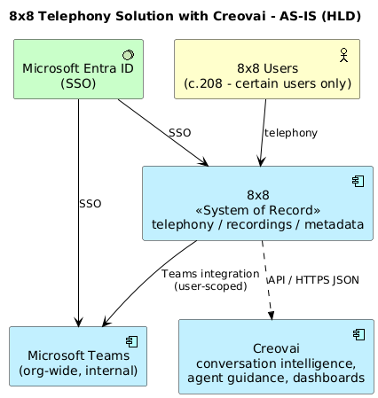

# 8x8 Telephony Solution with Creovai — AS-IS (HLD)

**Notation:** ArchiMate 3.x · three layers only — Business (yellow), Application (blue), Technology (green).
**Status:** Draft for TDA review · **Date:** 2026-06-16

---

## Diagram

> Source: [`diagrams/as-is-hld.puml`](diagrams/as-is-hld.puml)

## The 5 boxes

| Box | Layer | Notes |
|-----|-------|-------|
| **8x8 Users (c.208)** | Business | Certain users only (Delivery & Schemes / IT Service Desk). |
| **Microsoft Teams** | Application | Used org-wide internally; 8x8 telephony surfaced *within* Teams for enabled users. |
| **8x8** | Application | **System of record** — telephony, recordings, metadata. |
| **Creovai** | Application | Downstream analytics: conversation intelligence, agent guidance, dashboards. |
| **Microsoft Entra ID** | Technology | SSO authentication. |

## How it links (the only flows that matter)

- **Users → 8x8 (telephony).** Users initiate calls; 8x8 processes them.
- **Entra ID → 8x8 (SSO)** and **Entra ID → Teams (SSO).** Two **independent** SSO arrows — both systems authenticate directly against Entra (not chained via Teams). Azure governs **access only**.
- **8x8 → Teams (Teams integration, user-scoped).** 8x8 is integrated into Teams; telephony surfaced inside Teams for enabled users only.
- **8x8 ⟷ Creovai (API / HTTPS JSON).** A **single** integration path — **no Azure involvement**.

## Correctness (key points)

- **Creovai integrates only with 8x8 — not Azure.** Only 8x8 connects to Azure.
- **8x8 is the single system of record**; all downstream data originates from 8x8.
- **Entra ID governs identity/access for 8x8 and Teams only** and does not touch Creovai.

---

*Detail-level views (layered, data-flow) were removed to keep the HLD to a single,
simple picture. To regenerate the PNG: `java -jar plantuml.jar -tpng diagrams/as-is-hld.puml`.*
