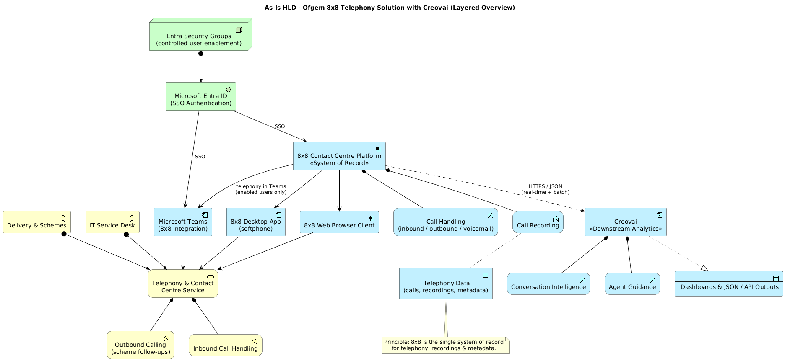
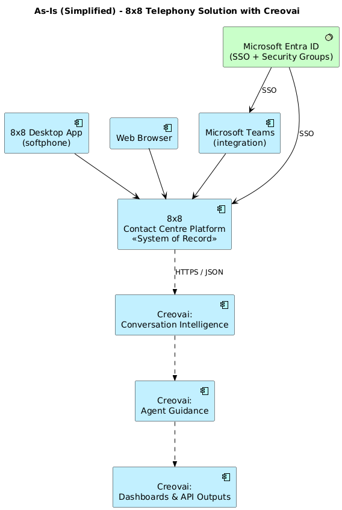
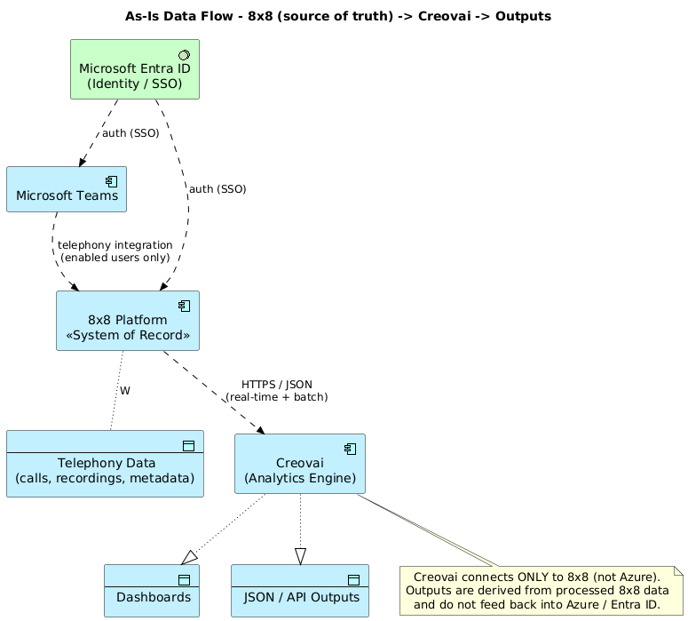

# As-Is High-Level Design (HLD) — Ofgem 8x8 Telephony Solution with Creovai

**Document type:** Architecture HLD (As-Is) · ArchiMate 3.x notation
**Status:** Draft for Technical Design Authority (TDA) review
**Scope:** Telephony & contact-centre platform (8x8), Microsoft Teams integration, Microsoft Entra ID identity, and the Creovai downstream analytics service.
**Date:** 2026-06-16

---

## 1. Purpose

This document captures the **current (As-Is)** architecture of Ofgem's telephony
estate as a baseline for Technical Design Authority (TDA) discussion and for any
subsequent To-Be design work. It is expressed using **ArchiMate** layered views so
that the business, application, and identity/technology concerns can be reasoned
about separately.

The architecture is deliberately a **single, controlled integration chain**:

> **8x8 is the system of record, Microsoft Entra ID controls identity and access,
> and Creovai consumes data from 8x8 only — via a single, controlled integration path.**

---

## 2. Key architectural principles (As-Is)

| # | Principle | Implication |
|---|-----------|-------------|
| P1 | **8x8 is the single system of record** for telephony, recordings and metadata. | No downstream platform owns telephony data; all data originates from 8x8. |
| P2 | **All downstream integrations originate from 8x8 only.** | There is no branching of telephony data via Azure or any other platform. |
| P3 | **Identity is governed centrally, but only for access.** | Microsoft Entra ID (SSO + security groups) governs access to **8x8 and Teams only**. |
| P4 | **Creovai is a downstream analytical service with no direct dependency on Azure.** | Creovai connects **only to 8x8** (HTTPS/JSON). It does not authenticate against, or integrate with, Entra ID. |
| P5 | **Single-chain data flow.** | `8x8 → Creovai → Outputs`. Real-time and batch, no branching. Outputs do not feed back into Azure. |

---

## 3. Stakeholders & business context

- **Delivery & Schemes** — primary operational users; predominantly **outbound**
  calling (e.g. scheme follow-ups) plus some inbound.
- **IT Service Desk** — inbound/outbound call handling and support.
- Access is **user-based (licensed)** — each user is assigned an 8x8 account.

---

## 4. ArchiMate views

### 4.1 Layered overview

The full layered view shows the business service, the access channels, the 8x8 core
platform (system of record), the Creovai downstream analytics, and the Entra ID
identity layer.



> Source: [`diagrams/as-is-layered-overview.puml`](diagrams/as-is-layered-overview.puml)

### 4.2 Simplified view (for TDA / slides)

This is the simplified rendering requested in review: the three **Creovai** boxes are
placed at the bottom as a single chain, with **one controlled arrow into/out of 8x8**.
Entra ID governs access to 8x8 and Teams **only** — it does not touch Creovai.



> Source: [`diagrams/as-is-simplified.puml`](diagrams/as-is-simplified.puml)

### 4.3 Data-flow / integration view



> Source: [`diagrams/as-is-dataflow.puml`](diagrams/as-is-dataflow.puml)

---

## 5. Component descriptions

### 5.1 Core platform — 8x8 (System of Record)

8x8 is the **primary telephony and contact-centre platform** used across Delivery &
Schemes and the IT Service Desk.

- Handles **inbound/outbound calls, voicemail, and basic call handling**.
- Owns **telephony, recordings, and metadata** — the **system of record** (no
  downstream platform ownership elsewhere).
- Acts as the **single source of truth** and the **only origin** of downstream data.

### 5.2 User access model

Users access 8x8 telephony services via three channels:

| Channel | Notes |
|---------|-------|
| **8x8 Desktop App (softphone)** | Primary client. |
| **Web browser client** | Browser-based access. |
| **Microsoft Teams (via integration)** | Optional; telephony functionality and presence/calling **within Teams**. Scoped to **enabled users only** via an Entra security group. **Does not connect to Creovai.** |

All user access is to **8x8**, which remains the system of record.

### 5.3 Identity & access — Microsoft Entra ID

- Authentication is integrated with **organisation login (Entra ID / SSO)**.
- **Security groups** provide controlled user enablement (e.g. who gets the Teams
  integration).
- Azure **only governs access** to 8x8 and Teams. It does **not integrate directly
  with Creovai**.

### 5.4 External integration — Creovai (Downstream Analytics)

- Creovai connects **only to 8x8** (not Azure) and is used for:
  - **Conversation intelligence**
  - **Agent guidance**
- Data exchange is a single controlled path: **8x8 ⟷ Creovai (HTTPS / JSON)**,
  real-time and batch.

### 5.5 Outputs / consumption

Creovai produces:

- **Dashboards**
- **JSON / API outputs**

These are **derived from processed 8x8 data** and **do not feed back into Azure**.

---

## 6. Current limitations (key for narrative)

These constraints are the rationale for any future To-Be work:

- **Fragmented configurations across teams** → inconsistent user experience.
- **Limited reporting and analytics** → reduced visibility of performance.
- **Minimal integration with CRM or other systems** (APIs for Power BI / CRM exist
  but are not fully implemented or standardised; usage is minimal/fragmented).
- **Underutilisation of advanced capabilities** (AI, automation, digital channels).
- **Manual processes still required** (reporting, notes, follow-ups often handled by
  email/notes outside the platform).
- **No consistent external analytics or data pipeline** beyond the single Creovai
  chain.

---

## 7. One-line summary

> The current 8x8 setup provides **core telephony with SSO access**, where **8x8 is
> the system of record**, **Entra ID controls identity and access (8x8 + Teams only)**,
> and **Creovai consumes data from 8x8 only via a single, controlled integration path**.

---

## 8. Notes on the model

- Notation: **ArchiMate 3.x**, authored as **PlantUML** (`!include <archimate/Archimate>`)
  so the views are text-based and version-controlled.
- **Layers & palette:** the model is restricted to the three core ArchiMate layers,
  using the standard palette colours:

  | Layer | Colour | Elements in this model |
  |-------|--------|------------------------|
  | **Business** | Yellow | Delivery & Schemes, IT Service Desk (actors); Telephony & Contact Centre Service; Inbound/Outbound Calling (functions) |
  | **Application** | Blue | 8x8 Contact Centre Platform; 8x8 Desktop App, Web client, Teams integration; Call Handling, Call Recording; Telephony Data; Creovai, Conversation Intelligence, Agent Guidance, Dashboards/API Outputs |
  | **Technology** | Green | Microsoft Entra ID (SSO); Entra Security Groups |

  No Motivation, Strategy, Implementation or Physical elements are used — the single
  guiding principle (8x8 = system of record) is shown as a neutral annotation rather
  than as a Motivation-layer element.
- Diagrams render with PlantUML + Graphviz. To regenerate the PNGs:

  ```bash
  cd docs/architecture/diagrams
  java -jar plantuml.jar -tpng *.puml
  ```

- The three `.puml` sources are the authoritative model; the PNGs are generated
  artefacts checked in for convenience (slides / review).
